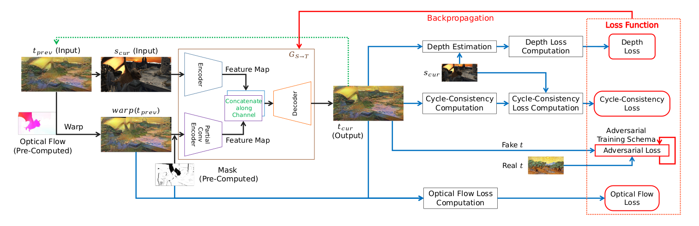

# Stable Video Style Transfer Based on Partial Convolution with Depth-Aware Supervision

## Overview

This is official pytorch implementation of paper *Stable Video Style Transfer Based on Partial Convolution with Depth-Aware Supervision*. The baseline in the paper is [Cycle-GAN](https://arxiv.org/pdf/1703.10593.pdf), and this project is developed based on their [opensource pytorch implementation](https://github.com/junyanz/pytorch-CycleGAN-and-pix2pix). The system overview is shown below.



As shown in the figure, there are three modules beyond the contribution of this repository: optical flow estimation module, occlusion and motion mask estimation module, and depth estimation module. In the paper, optical flow estimation module is [FlowNet 2.0](https://github.com/NVIDIA/flownet2-pytorch), motion mask estimation module is a forward-backward consistency checker from [here](https://github.com/manuelruder/artistic-videos/tree/master/consistencyChecker), and depth estimation module is from paper [*Single Image Depth Perception in the Wild*](https://arxiv.org/abs/1604.03901).

There is already a depth estimation module in this repository from [here](https://github.com/yifjiang/relative-depth-using-pytorch). As for optical flow and mask estimation modules, you can follow their guide to set them up. You can also try other estimation algorithms freely.

Some example: 

* Video to VanGogh:

  

  

* Video to Monet: 

  

  

* Video to Chinese watercolor:

  

  

## Prerequisites
* Linux or macOS
* Python 3
* PyTorch 0.4+ and other dependencies (torchvision, visdom, dominate, and other common python libs)

## Getting Started

* Clone this repository:

  ```shell
  git clone https://github.com/AnAnonymousProgrammer/Artistic-Video-State-of-the-Art
  cd Artistic-Video-State-of-the-Art
  ```

* Dataset preparation:

  * For training of the image stage, there should be four folders named *trainA*, *trainB*, *testA*, and *testB* under root of the dataset. Please put style images in *trainA* and *testA*, and put content images in *trainB* and *testB*. The structure of image dataset is shown in *datasets/image*.
  * For training of the video stage, there should be five folders named *frame*, *flow*, *mask*, *style*, *last_fake*. Frame, optical flow, and mask of one video clip should be put in a separated sub-folder under the corresponding folder. Pay attention to the relative order of video clips in these three folders. Style images should be put under *style*. As for *last_fake*, you should run the test of stage 1 for **the last frame** of each video clip and then put the generated results under this folder. Also, please pay attention the relative order. A sample structure is shown in *datasets/video*.
  * Provided datasets for this paper will be ready soon.

* Train/Test:

  * Before training, start *visdom* server:

    ```
    python -m visdom.server
    ```

  * We provide simple start-up scripts for training and testing of image stage and video stage:

    * Start training for image stage:

      ```shell
      python simple_train_image.py
      ```

    * Start testing for image stage (required before video stage):

      ```bash
      python simple_test_image.py
      ```

    * Start training for video stage:

      ```
      python simple_train_video.py
      ```

    * Start testing for video stage:

      ```
      python simple_test_video.py
      ```

  * For more options, you may need to modify scripts above. 

  * Pre-trained models will be ready soon. 

## Acknowledgments

We sincerely thank: 

* Junyan Zhu *et al.* providing baseline and its implementation for this paper. 
* Guilin Liu *et al.* providing partial convolution implementation. 
* Weifeng Chen *et al.* providing depth estimation solution and YifJiang providing pre-trained depth estimation model.